# 2021-01
**1) Com’è classificata la riusabilità di un software?** \
a. Esterna e di Processo \
b. Interna e di Prodotto \
c. Esterna e di Prodotto \
d. Interna e di Processo 

**2) Quali di questi diagrammi UML vengono normalmente utilizzati a supporto del collaudo del software, con particolare 
riferimento al “testing in the large”?** \
a. Sequenza \
b. Attività \
c. Classi \
d. Casi d'uso 

**3) Quali di queste tecniche di verifica sono applicabili in un contesto black-box?** \
a. Code walk-through \
b. Testing in the small \
c. Code inspection \
d. Testing in the large \
e. nessuna delle precedenti 

**4) Un software viene modificato per aumentare l'efficienza di una funzionalità di importazione massiva di dati. Di che 
tipo di manutenzione si tratta?** \
a. Correttiva \
b. Evolutiva \
c. Perfettiva \
d. Adattiva 

**5) Quali di questi modelli sono specificamente pensati per situazioni progettuali in cui i requisiti utente sono incerti o 
mutevoli nel tempo?** \
a. Modello MDA \
b. Modello RAD \
c. Modello a cascata \
d. Nessuno dei precedenti 

**6) Quali delle seguenti affermazioni, riguardanti le funzioni di tipo dato e tipo transazione, sono vere?** \
a. La logica di un processo EQ (External Inquiry) non contiene formule matematiche o calcoli e non crea dati derivati \
b. Il compito primario di un EIF (External Interface File) è di contenere dati referenziati da uno o più processi elementari dell’applicazione che si sta contando \
c. Il compito principale di un EO (External Output) è di modificare il comportamento del sistema  \
d. Nessuna delle precedenti 

**7) Le special GUI sono pensate per situazioni in cui...** \
a. ...l'utente deve effettuare un data-entry massivo \
b. ...l'utente può avere scarsa esperienza con l'utilizzo dei PC \
c. ...la soddisfazione dell'utente nell'uso dell'interfaccia è importante \
d. ...memorabilità e apprendibilità dell'interfaccia non sono importanti

**8) L'autenticazione a un portale si può effettuare tramite email oppure tramite lo SPID (Sistema Pubblico d'Identità 
Digitale). Scegliere tra le seguenti soluzioni di modellazione quella più corretta.** \


# 2021-02
**1) Un operaio effettua turni settimanali di lavoro alle macchine. Durante ogni turno ciascun operaio lavora a una singola 
macchina, e ogni macchina è manovrata da un singolo operaio. Scegliere, tra le seguenti soluzioni di modellazione, quella 
ritenuta più appropriata.** \


**2) Cosa si intende per “messa in produzione” del software?** \
a. il momento in cui inizia la fase di analisi dei requisiti \
b. il momento in cui inizia la fase di esercizio del software \
c. il momento in cui inizia la fase di implementazione \
d. il momento in cui inizia la fase di diagnosi e manutenzione \
e. il momento in cui inizia la fase di progettazione del software \
f. il momento in cui inizia la fase di collaudo \
g. il momento in cui il software viene installato 

**3) Quali tra i seguenti sono meccanismi di estendibilità in UML?** \
a. specifiche \
b. viste \
c. profili \
d. diagrammi \
e. proprietà \
f. stereotipi 

**4) E' dato il seguente frammento di pseudocodice:**
``` 
begin 
    read (A,B,C)
    if (A>0) AND (B<0) then 
        C := C/(A+B) 
end 
```
Quali dei seguenti insiemi di test soddisfano il criterio di copertura delle decisioni? \
a. {(A=2, B= –1, C=3), (A= –1, B=2, C=0)} \
b. {(A=2, B=1, C=0), (A=-1, B= –1, C=3)} \
c. {(A=2, B= –1, C=3)} \
d. {(A=2, B= –1, C=3), (A= –1, B= –1, C=3)} 

**5) Cosa si intende per affordance in ambito interfacce utente?** \
a. il posizionamento strutturato di testo, disegni e controlli all’interno di un’area grafica considerata \
b. gli aspetti grafici di un oggetto che invitano l'utente a interagire con quell'oggetto in un certo modo \
c. una figura che illustra un oggetto attraverso una somiglianza o un’analogia con un concetto del mondo reale 

**6) Quali tra le seguenti tecniche possono essere ricondotte al principio di separazione degli argomenti?** \
a. la capacità di prevedere i cambiamenti a cui il software sarà sottoposto durante il suo ciclo di vita \
b. la ricerca di un problema noto che generalizzi il problema da risolvere \
c. l'utilizzo di formalismi e metodologie standard \
d. l'identificazione, nel ciclo di vita, di attività distinte e temporalmente correlate  \
e. l'identificazione di moduli distinti e interconnessi all'interno del software 

# 2021-06
**1) Dato il seguente frammento di pseudocodice, se ne calcoli la complessità ciclomatica:**
```
begin 
  read(N); 
  read(x); 
  for i:=1 to N do 
    read(V[i]); 
  i:=1; 
  K:=0; 
  while (i<N) AND (K<100) do 
  begin 
    if (x<>0) 
      V[i]:=(V[i]+V[i+1])/x; 
    K:=K+V[i]; 
    i:=i+1; 
  end 
end 
```
**2) Dati i due seguenti frammenti di diagrammi degli stati, dire se modellano lo stesso comportamento al variare di 
temperatura e pressione.**
 

a. SI \
b. NO \
c. solo quando o temperatura o pressione si mantengono costanti 

**3) In un diagramma di deployment, quali tra i seguenti possono essere modellati come manufatti?** \
a. un file sorgente Java \
b. un file eseguibile \
c. un PC usato come server \
d. l’ambiente Apache 

**4) Quali sono i risultati attesi da uno studio di fattibilità?** \ 
a. stima dei costi del software \
b. stima dei tempi di realizzazione del software \
c. valutazione dei benefici del software \
d. macroanalisi dei requisiti \
e. progetto di massima del software \
f. casi d’uso del software 

**5) A quali di questi criteri è consigliato attenersi nella scelta dei colori per un’interfaccia grafica?** \
a. basarsi su un codice di due soli colori \
b. basarsi su un codice di non più di cinque colori \
c. usare colori vivaci per aree grandi e neutri per aree piccole \
d. non usare colori contrastanti tra loro per evitare affaticamento della vista \ 
e. se lo sfondo è chiaro, usare un colore scuro per il testo \
f. usare colori brillanti per applicazioni gestionali 

**6) Cosa afferma il principio di anticipazione dei cambiamenti?** \
a. un software deve soddisfare esclusivamente le specifiche funzionali attuali \
b. un software deve soddisfare sia le specifiche funzionali attuali sia quelle prevedibili per il breve/medio termine \
c. un software deve soddisfare le specifiche funzionali attuali ma essere predisposto per poter soddisfare, con bassi costi \
di manutenzione, anche quelle prevedibili per il breve/medio termine 

# 2024-01   60 min

**1. Il meccanismo di Start-Stop nelle automobili ha l’obiettivo di ridurre gli sprechi di carburante. Nel momento in cui il veicolo si ferma (per esempio a un semaforo), il motore viene automaticamente spento, per essere automaticamente riavviato quando il veicolo si rimette in movimento (quando lo Start-Stop si attiva, viene mostrata una spia sul cruscotto). Se la carica della batteria scende sotto una soglia di sicurezza, il meccanismo non viene attivato. Selezionare, tra i seguenti diagrammi degli stati, quelli corretti e compatibili con le specifiche (6/31 punti).**


a

b

c

d

**2. Un software viene modificato per conformare l’operatività di una funzionalità di reportistica a quanto indicato nel capitolato di gara. Di che tipo di manutenzione si tratta? (2/31 punti)**
a. Correttiva
b. Evolutiva
c. Perfettiva
d. Adattiva

**3. Quali delle seguenti affermazioni riguardanti il numero ciclomatico sono vere? (2/31 punti)**
a. il numero ciclomatico di un grafo fortemente connesso è il numero minimo di archi che si devono eliminare per
trasformarlo in un albero
b. il numero ciclomatico di un programma esprime il numero di cammini linearmente indipendenti nel suo grafo di
controllo
c. il numero ciclomatico di un programma è pari al numero dei punti di decisione del programma
d. la complessità ciclomatica di un modulo non dovrebbe superare il valore 10
e. il numero ciclomatico di un programma è calcolabile come e-n+1, dove e è il numero degli archi ed n è il numero dei
nodi

**4. Nell’ambito di Unified Process (UP), cosa si intende per construction? (1/31 punti)**
a. la fase in cui si definiscono gli obiettivi di progetto
b. la fase in cui vengono definite le caratteristiche funzionali, strutturali e architetturali del software
c. la fase in cui il software viene sviluppato e collaudato
d. la fase in cui il software viene consegnato, installato e configurato

**5. Dato il seguente frammento di pseudocodice, ricavare la sequenza relativa alla variabile a secondo la tecnica di analisi di flusso dei dati: (3/31 punti)**

```java
begin
read(a);
read(b);
if (a<10) AND (b>100) then
begin
read(c);
if (c>0)
print(c)
else
print(-c);
a:=a+1;
b:=b-2
end;
print(a);
print(b)
end
```

**6.Com’è classificata la facilità di manutenzione di un software? (1/31 punti)**
a. Esterna e di Processo
b. Interna e di Prodotto
c. Esterna e di Prodotto
d. Interna e di Processo

**7. Quali dei seguenti requisiti incoraggiano l’adozione di una standard GUI? (2/31 punti)**
a. elevata mole di lavoro da svolgere
b. data entry per dati fortemente strutturati
c. riutilizzo della conoscenza pregressa
d. soddisfazione dell’utente
e. flusso di interazione predefinito e rigido
f. flessibilità di interazione

# 2024-02 60 min

**1. Nell’ambito di Unified Process (UP), abbinare a ciascuna fase la corrispondente milestone: (2/31 punti)**

Inception
Elaboration
Construction
Transition

versione del software in produzione
specifica dei requisiti e architettura
documenti di fattibilità
versione beta del software

**2. Nell’analisi orientata alle funzioni, il sistema da realizzare è rappresentato come (1/31 punti)**

a. una rete di processi che ricevono e generano flussi informativi
b. un insieme di classi e relazioni tra di esse
c. una rete di stati e transizioni di stato
d. un insieme di componenti architetturali e dipendenze tra di essi

**3. Quali sono le principali caratteristiche del modello di sviluppo del software a cascata? (1/31 punti)**

a. è efficace quando i requisiti di analisi non sono chiari a priori
b. permette di modificare i risultati delle fasi precedenti alla luce di errori riscontrati a posteriori
c. genera prototipi funzionanti al termine di ogni fase
d. si basa su modelli formali del software che vengono fatti evolvere durante lo sviluppo
e. nessuna di queste

**4. Nel metodo Co.Co.Mo, qual è il ruolo degli stimatori di costo? (1/31 punti)**

a. rifinire la stima di mesi nominali
b. calcolare il numero di mesi nominali in funzione della classe del software
c. permettere di determinare la classe del software

**5.Cosa si intende per trasparenza di un processo di produzione del software? (2/31 punti)**
a. la facilità con la quale si possono valutare le qualità del software prodotto
b. la capacità del processo di rispettare i tempi di consegna previsti
c. la facilità nel capire lo stato attuale del processo
d. il fatto che la correttezza del software sia facilmente verificabile tramite tecniche di testing e di analisi

**6. Quali delle seguenti affermazioni generali relative al linguaggio UML sono vere? (2/31 punti)**

a. UML è un linguaggio standard basato su un metamodello
b. UML deve essere utilizzato in abbinamento a Unified Process
c. un’entità di UML può essere rappresentata con notazioni diverse a seconda del diagramma in cui compare
d. un’entità di UML può essere rappresentata con notazioni diverse a seconda del livello di dettaglio che si vuole mostrare
e. un modello è una particolare visualizzazione di alcuni tipi di elementi di un diagramma
f. una associazione è un caso particolare di aggregazione
g. se una classe è un’interfaccia, allora è una classe astratta
h. se una classe è astratta, allora è una interfaccia

**7. E' dato il seguente frammento di pseudocodice:**
```java
begin
read(A,B,C)
if (A>=0) AND (B<=0) then
C := C/(A+B)
end
```

**Quali dei seguenti insiemi di test soddisfano il criterio di copertura dei comandi (o programmi)? (3/31 punti)**
a. {(A=1, B= 0, C=1), (A= –1, B=2, C=0)}
b. {(A= –2, B=1, C=0), (A= –1, B= –1, C=3)}
c. {(A=1, B=1, C= –1)}
d. {(A=0, B=1, C=0), (A= –1, B= –1, C=3)}

**8. Nella programmazione giornaliera di un cinema multisala, un film può essere proiettato in contemporanea in più sale, anche in più slot orari. Naturalmente la stessa sala può proiettare diversi film in diversi orari. Scegliere, tra le seguenti soluzioni di modellazione, quelle che rispettano le specifiche (6/31 punti).**
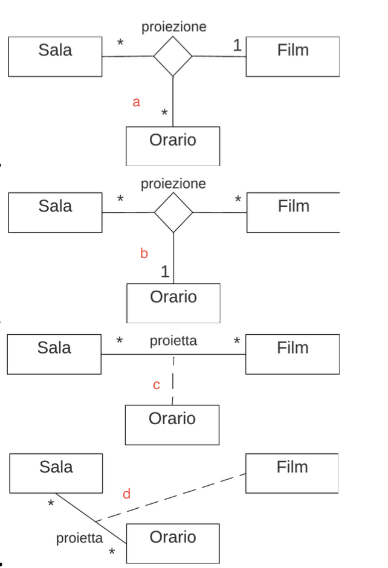

# 2024-06

**1. A quali tipi di elementi UML si applica la relazione di contenimento, rappresentata da un segno + circondato da un cerchio? (1/31 punti)**

a. alle classi
b. ai casi d’uso
c. ai package
d. agli stati
e. ai componenti
f. ai nodi

**2. Quali tra i seguenti diagrammi UML possono avere sia forma di descrittore sia forma di istanza? (2/31 punti)**

a. deployment
b. classi
c. stati
d. casi d’uso

**3. Quali delle seguenti affermazioni riguardanti la prototipazione evolutiva sono vere? (1/31 punti)**

a. permette di dimostrare in anticipo i requisiti agli utenti
b. tende a corrompere il sistema rendendone costosa la manutenzione
c. si focalizza sui requisiti meno chiari
d. può essere usata per prototipare una interfaccia utente

**4. Dato il seguente frammento di pseudocodice, se ne calcoli la complessità ciclomatica: (3/31 punti)**

```java
begin
read(x);
read(y);
read(z);
if (x=0)
then x:=1
else z:=0;
y:=y/z;
if (y>0)
then print(x);
else print(z);
end
```

**5. In quali situazioni è particolarmente importante, tra i fattori di usabilità di un'interfaccia, l’apprendibilità? (2/31 punti)**

a. quando il ciclo di vita del software utilizzato è lungo
b. quando il turn-over degli utenti è elevato
c. quando è necessario contenere i tempi del training
d. quando gli utenti usano il software saltuariamente
e. quando i risultati del software sono immediatamente visibili ai clienti esterni

**6. Quali tra le seguenti sequenze, risultanti dall'applicazione della tecnica di analisi del flusso dei dati a una variabile usata in un frammento di codice, vengono considerate corrette? (2/31 punti)**

a. duaduuua
b. aduaddua
c. dauuduua
d. aduduadu

**7. Gli operatori di un provider telefonico effettuano chiamate a consumatori (clienti o prospect, ossia potenziali clienti) per proporre offerte relative a servizi. A seguito di una chiamata, il cliente può direttamente accettare l’offerta, rifiutarla, o chiedere di essere richiamato dopo una settimana. Scegliere, tra le seguenti soluzioni di modellazione, quelle corrette e coerenti con le specifiche (6/31 punti).**

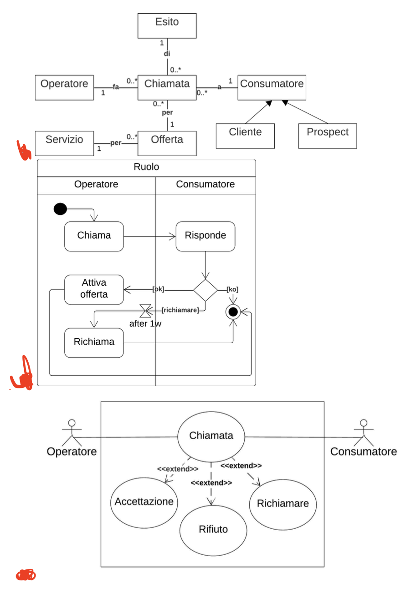

# 2024 - 07

**2. Quali sono le differenze tra collaudo in fabbrica (alfa-test) e collaudo del sistema installato (beta-test)? (2/31 punti)**

a. il primo è effettuato dagli sviluppatori, il secondo dagli utenti finali
b. il primo viene effettuato su una versione prototipale del software, il secondo sulla versione finale
c. il primo mira a trovare errori e malfunzionamenti nel software, il secondo a migliorarne le prestazioni
d. il primo viene effettuato prima della messa in esercizio, il secondo dopo

**3. Com’è classificata la portabilità di un software? (1/31 punti)**

a. Esterna e di Processo
b. Interna e di Prodotto
c. Esterna e di Prodotto
d. Interna e di Processo

**4. Quali dei seguenti requisiti incoraggiano l’adozione di una standard GUI? (2/31 punti)**

a. elevata mole di lavoro da svolgere
b. data entry per dati fortemente strutturati
c. riutilizzo della conoscenza pregressa
d. soddisfazione dell’utente
e. flusso di interazione predefinito e rigido
f. flessibilità di interazione

**5. E' dato il seguente frammento di pseudocodice:**

```java
begin
read(A,B,C)
if (A>=0) AND (B<=0) then
C := C/(A+B)
end
```

**Quali dei seguenti insiemi di test soddisfano il criterio di copertura dei programmi (statement test)? (4/31 punti)**
a. {(A=1, B=0, C=1), (A= –1, B=2, C=0)}
b. {(A= –2, B=1, C=0), (A=1, B=1, C=3)}
c. {(A=1, B=2, C= –1)}
d. {(A=0, B=1, C=0), (A=1, B= –1, C=3)}

**6.Quali tra i seguenti aspetti caratterizzano i modelli agili di produzione del software? (2/31 punti)**
a. sono prescrittivi
b. scoraggiano la consegna anticipata del software
c. incoraggiano l’incrementalità
d. richiedono un elevato livello di formalità nella documentazione
e. richiedono frequente comunicazione tra sviluppatori e utenti
f. impiegano team di progettisti molto ampi

**7. Dato il diagramma delle classi in figura, indicare quali dei diagrammi degli oggetti sono con esso compatibili (6/31punti).**
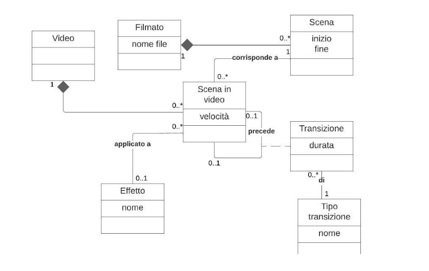
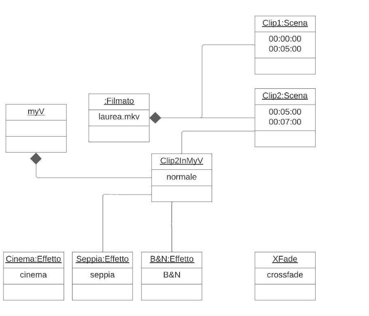
a
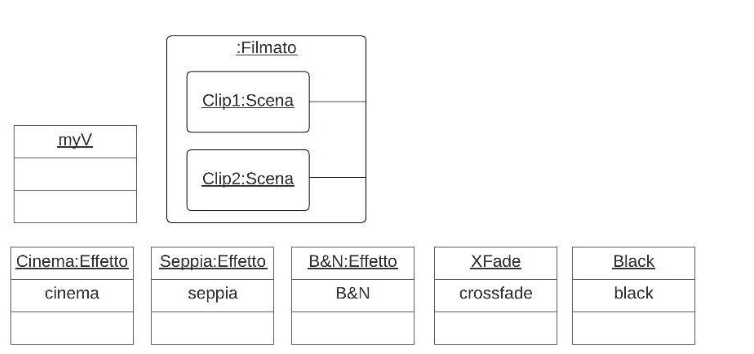
b
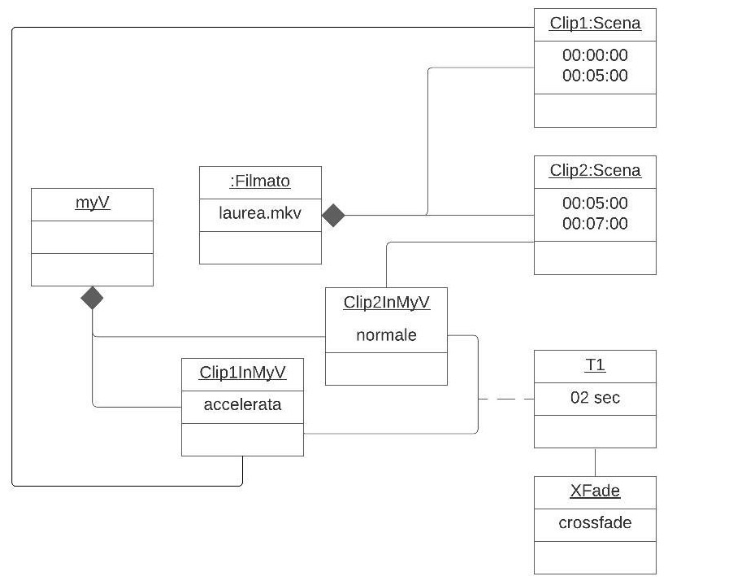
c

# 2024 - 09

**2) Un parcheggio a pagamento è governato da una telecamera, che legge la targa all’ingresso di ciascuna auto. Al termine del parcheggio, il guidatore paga il parcheggio presso un apposito totem, poi si presenta all’uscita. La telecamera rileva la targa e solleva la sbarra. Scegliere, tra le seguenti soluzioni di modellazione, quelle corrette e compatibili con le specifiche (6/31 punti).**

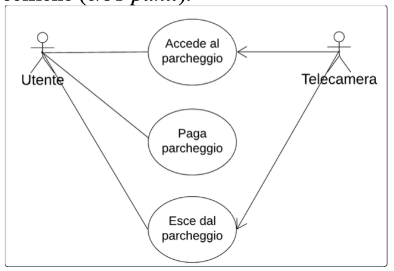
a
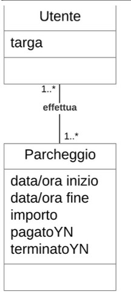
b
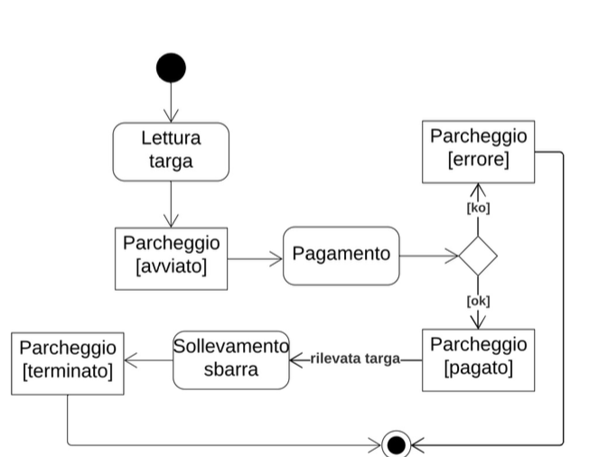
c
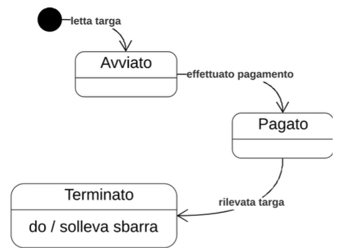
d

**3) Dato il diagramma di attività in figura, quali delle seguenti affermazioni riguardanti le azioni raffigurate sono vere? (4/31 punti)**

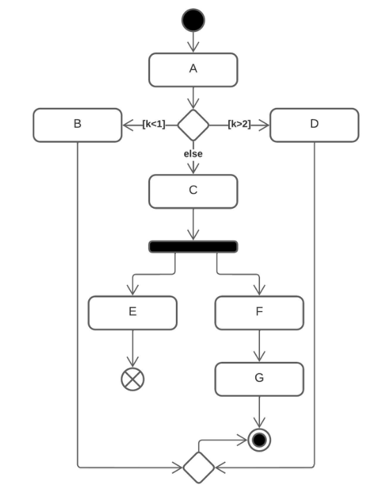

a. se k=1 viene eseguita E
b. entrambe B e D possono essere eseguite in modo concorrente
c. tra E e F, solo una può essere eseguita
d. G può essere eseguita prima di D
e. G può essere eseguita prima di E
f. è possibile che F venga eseguita dopo che E è terminata
g. è possibile che E venga eseguita dopo che G è terminata
h. è possibile che E venga eseguita dopo che F è terminata

**4) “Una coppia di sposi si reca presso il negozio e compila la lista di nozze insieme a una commessa”. Questa specifica**

è rilevante con riferimento a quali tipi di aspetti? (2/31 punti)
a. statici
b. dinamici
c. funzionali

**5) Dato il seguente frammento di pseudocodice, se ne calcoli la complessità ciclomatica: (3/31 punti)**

```java
begin
read(N);
read(x);
for i:=1 to N do
read(V[i]);
i:=1;
K:=0;
while (i<N) AND (K<100) do
begin
if (x<>0)
V[i]:=(V[i]+V[i+1])/x;
K:=K+V[i];
i:=i+1;
end
end
```

**6) Quali tra i seguenti sono meccanismi di estendibilità in UML? (1/31 punti**
a. specifiche
b. viste
c. profili
d. diagrammi
e. proprietà
f. stereotipi

**7) Qual è la differenza tra errori bloccanti e non bloccanti rilevati durante il collaudo di un sistema software? (1/31 punti)**

a. i primi pregiudicano lo svolgimento del collaudo, i secondi no
b. i primi comportano l’arresto del software, i secondi no
c. i primi sono relativi all’operatività, i secondi agli aspetti prestazionali
d. non esiste questa differenziazione

# 2024 - 11

**2) In che modo si può esprimere una precondizione nel diagramma dei casi d'uso? (1/31 punti)**

a. nella scheda di specificazione di un caso d'uso
b. tramite una dipendenza <<include>>
c. tramite una dipendenza <<extend>>
d. tramite un'associazione unidirezionale con un attore
e. non si può esprimere

**3) Come può essere utilizzata una relazione di realizzazione/raffinamento dall'entità A all'entità B in UML? (2/31punti)**

a. per mostrare che una modifica in B può comportare una modifica in A
b. per mostrare che A è una versione più complessa o dettagliata di B
c. per mostrare che A è un'implementazione di B
d. per mostrare che A specializza B
e. per mostrare che A contiene B

**4) E' dato il seguente frammento di pseudocodice:**
```java
begin
read(A,B,C)
while (A>0) OR (B>0) then
begin
C := C/(A+B)
A--
B--
end
end
```
**Quali dei seguenti test soddisfano il criterio di copertura delle istruzioni (statement test)? (4/31 punti)**
a. {(A=2, B= –1, C=3)}
b. {(A=2, B=1, C=0)}
c. {(A= –2, B= –1, C=3)}
d. {(A= –2, B=0, C=0)}

**5) Un software viene modificato per aggiungere una funzionalità di esportazione dati prevista nel capitolato di gara ma assente nella prima release del software. Di che tipo di manutenzione si tratta? (1/31 punti)**

a. Correttiva
b. Evolutiva
c. Perfettiva
d. Adattiva

**6) In quali situazioni è particolarmente importante, tra i fattori di usabilità di un'interfaccia, la memorabilità? (2/31 punti)**

a. quando il software è di utilizzo secondario
b. quando il turn-over degli utenti è elevato
c. quando è richiesta elevata flessibilità nell’interazione con l’utente
d. quando gli utenti usano il software saltuariamente
e. quando i risultati del software sono immediatamente visibili ai clienti esterni

**7) Quale di questi modelli di produzione del software è specificamente pensato per ridurre la durata del ciclo di sviluppo per software facilmente modularizzabili? (1/31 punti)**

a. modello a cascata
b. modello RAD
c. modello evolutivo a spirale
d. model-driven development
e. modello extreme programming

**8) Si vuole modellare il processo di contravvenzione a seguito di infrazioni rilevate da autovelox. L’autovelox rileva la velocità di un veicolo in una certa data e ora e in un certo luogo; qualora la velocità superi il limite, invia all’ufficio vigili urbani una segnalazione corredata dal numero di targa. Il vigile apre la pratica e, qualora il limite non sia stato superato di più di 30 km/h, invia la contravvenzione all’intestatario del veicolo. Altrimenti, è prevista anche una decurtazione di punti. In questo caso, viene inviata anche una richiesta di conferma identità del guidatore. Se l’intestatario non era alla guida, comunica i dati del guidatore a cui viene poi girata la contravvenzione. Tra i seguenti, indicare i diagrammi delle attività che modellano queste specifiche correttamente (6/31 punti).**

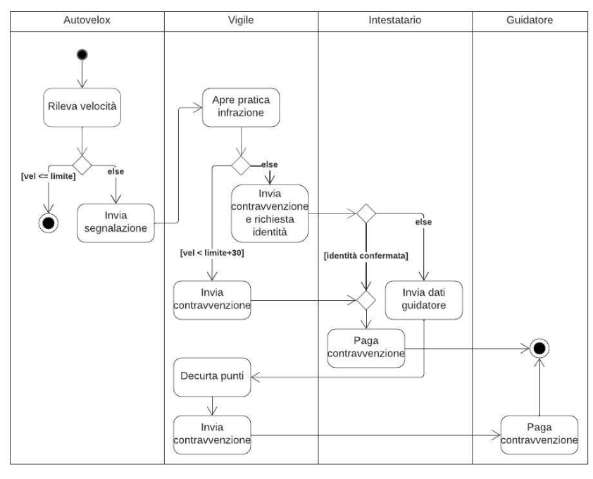
a
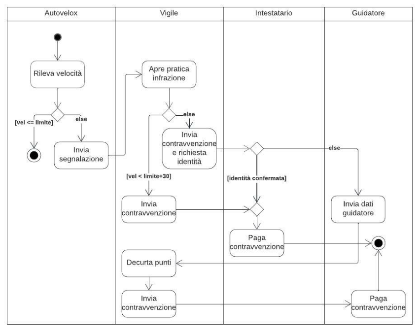
b
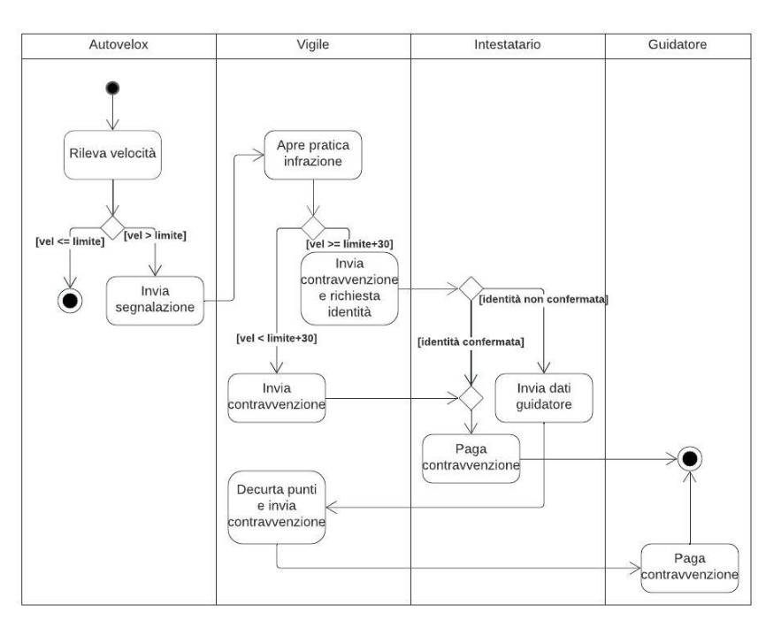
c
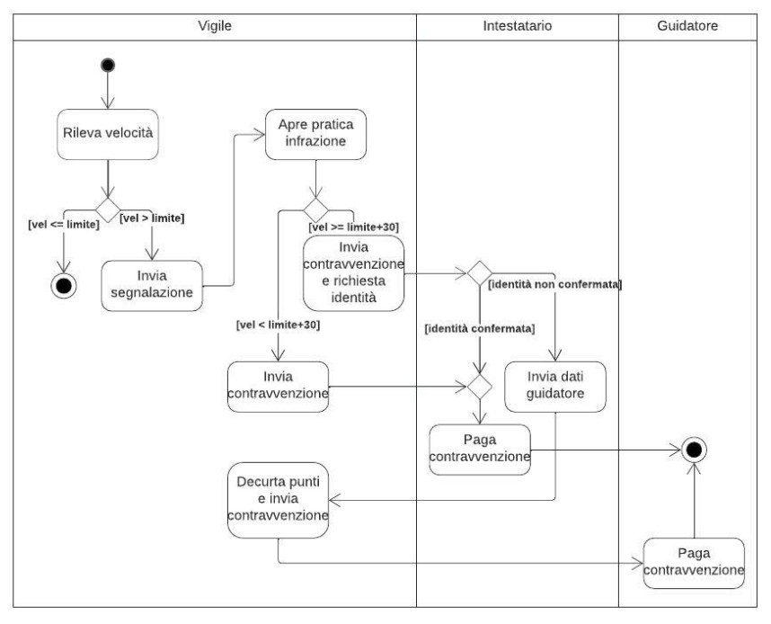
d

# 2023-09

**1) Con riferimento al diagramma degli stati UML mostrato in figura, quali delle seguenti affermazioni sono vere? (3/31 punti)**

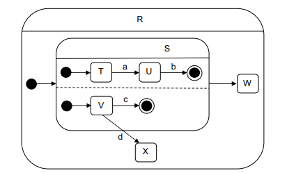

a. quando l’oggetto si trova nello stato R, può trovarsi indifferentemente negli stati S, X e W  

b. quando l’oggetto entra nello stato R, entra negli stati T e V 

c. quando accade l’evento c, l’oggetto entra nello stato W

d. l’oggetto non può trovarsi contemporaneamente negli stati T e V

e. l’oggetto non può trovarsi contemporaneamente negli stati T e X 

f. l’oggetto non può raggiungere lo stato X se prima non è accaduto l’evento a

a,b,e

**2) Quali di questi diagrammi UML vengono normalmente utilizzati a supporto del collaudo del software, con particolare riferimento al “testing in the large”? (1/31 punti)**

a. Sequenza

b. Attività

c. Classi

d. Casi d'uso

d

**3) Un software viene sottoposto a refactoring per renderlo più manutenibile. Di che tipo di manutenzione si tratta? (1/31punti)**

a. Correttiva

b. Evolutiva

c. Perfettiva

d. Adattiva

c

**4) Quale di questi modelli di produzione del software è specificamente pensato per ridurre la durata del ciclo di sviluppo per software facilmente modularizzabili? (2/31 punti)**

a. modello a cascata

b. modello RAD 

c. modello evolutivo a spirale

d. model-driven development

e. modello extreme programming

b

**5) Quali sono le principali caratteristiche del modello di produzione extreme programming? (2/31 punti)**

a. incoraggia la progettazione di funzionalità aggiuntive

b. in presenza di problemi di design, incoraggia il ricorso a spike solution

c. è pensato per ridurre il rischio di progetto

d. richiede comunicazione continua tra sviluppatori e utenti

e. è iterativo e incrementale

b,d,e

**6) Un gruppo di tabelle viene acceduto da un’applicazione A ma è gestito da un’applicazione B. In quale modo può essere classificato nel metodo function points applicato ad A? (2/31 punti)**

a. ILF (file interno logico)

b. EIF (file esterno di interfaccia)

c. EI (input esterno)

d. EO (output esterno)

e. EQ (query esterna)

b

**7) E’ dato il diagramma delle classi in figura, che rappresenta un portale per la gestione delle missioni effettuate dai volontari della vigilanza antincendio.**


Tra le seguenti, indicare le soluzioni di progetto delle associazioni ritenute corrette alla luce del seguente carico di
lavoro:

• visualizzare gli utenti che possiedono tutti i certificati richiesti da una certa missione (più volte al giorno);

• visualizzare le missioni organizzate da un certo amministratore (una volta alla settimana);

• visualizzare le ultime 3 missioni a cui un dato volontario ha partecipato (una volta al mese).


# 2023-07

**1) Quali delle seguenti affermazioni, riguardanti le funzioni di tipo dato e tipo transazione nel metodo Function Points,sono vere? (2/31 punti)**

a. La logica di un processo EQ (External Inquiry) non contiene formule matematiche o calcoli e non crea dati derivati

b. Il compito primario di un EIF (External Interface File) è di contenere dati referenziati da uno o più processi elementari dell’applicazione che si sta contando

c. Il compito principale di un EO (External Output) è di modificare il comportamento del sistema

d. Nessuna delle precedenti

a,b

**2) Quali di queste tecniche di verifica sono applicabili in un contesto black-box? (1/31 punti)**

a. Code walk-through

b. Testing in the small

c. Code inspection

d. Testing in the large

e. nessuna delle precedenti

d

**3) Con riferimento alle azioni A, B e C nel frammento di diagramma di attività UML mostrato in figura, quali delle
seguenti affermazioni sono vere? (3/31 punti)**


a. A non può iniziare se non è terminata B

b. C non può iniziare se non è terminata A

c. solo una tra B e C può avere luogo

d. B e C possono avere luogo in contemporanea

e. quando B termina, viene terminata anche C

f. quando C termina, viene terminata anche B

b,d,f

**4) Quali delle seguenti classi dovrebbero essere presenti nel metamodello di un diagramma degli stati? (2/31 punti)**

a. Messaggio

b. Dipendenza

c. Evento

d. Azione

e. Aggregazione

f. Classe

g. Flusso di oggetti

h. Attività

c,d,h

**5) Dato il seguente frammento di pseudocodice, se ne calcoli la complessità ciclomatica: (3/31 punti)**
```java
begin
read(N);
read(x);
for i:=1 to N do
  read(V[i]);
i:=1;
K:=0;
while (i<N) AND (K<100) do
begin
  if (x<>0)
    V[i]:=(V[i]+V[i+1])/x;
  K:=K+V[i];
  i:=i+1;
end
end
```
**1) L'azienda Buon Ristoro gestisce distributori di articoli (snack e bevande) installati presso locali pubblici. Gli utenti possono acquistare articoli dai distributori pagando in contanti (i distributori erogano il resto, se necessario) oppure attraverso chiavette ricaricabili. Gli operatori della Buon Ristoro periodicamente visitano i distributori per svuotarli dei
contanti accumulati e ricaricarli di articoli.**

Selezionare, tra i seguenti diagrammi, quelli corretti e compatibili con le
specifiche (6/31 punti).


a

# 2023-06

**1) Quali dei seguenti requisiti incoraggiano l’adozione di una interfaccia code-based? (1/31 punti)**

a. elevata mole di lavoro da svolgere

b. apprendibilità

c. riutilizzo della conoscenza pregressa

d. soddisfazione dell’utente

e. memorabilità

a

**2) Quale tra i seguenti meccanismi del paradigma a oggetti è alla base della progettazione di associazioni in UML?(1/31 punti)**

a. delegazione

b. ereditarietà

c. polimorfismo

d. incapsulamento

a

**3) Qual è la differenza tra errori bloccanti e non bloccanti rilevati durante il collaudo di un sistema software? (1/31 punti)**

a. i primi pregiudicano lo svolgimento del collaudo, i secondi no

b. i primi comportano l’arresto del software, i secondi no

c. i primi sono relativi all’operatività, i secondi agli aspetti prestazionali

d. non esiste questa differenziazione

a

**4) “Una coppia di sposi si reca presso il negozio e compila la lista di nozze insieme a una commessa”. Questa specifica è rilevante con riferimento a quali tipi di aspetti? (2/31 punti)**

a. statici

b. dinamici

c. funzionali

a,c

**5) A quali tipi di elementi UML si applica la relazione di contenimento, rappresentata da un segno + circondato da un cerchio? (1/31 punti)**

a. alle classi

b. ai casi d’uso

c. ai package

d. agli stati

e. ai componenti

f. ai nodi

c

**6) Quali tra i seguenti diagrammi UML possono avere sia forma di descrittore sia forma di istanza? (2/31 punti)**

a. deployment

b. classi

c. stati

d. casi d’uso

a,b

**7) Quale tra le seguenti qualità è posseduta da un processo di produzione del software in grado di valutare
correttamente e rispettare i tempi di consegna? (1/31 punti)**

a. robustezza

b. correttezza

c. efficienza

d. produttività

e. tempestività

e

**8) Quali delle seguenti classi dovrebbero essere presenti nel metamodello di un diagramma delle classi? (2/31 punti)**

a. Messaggio

b. Dipendenza

c. Evento

d. Azione

e. Aggregazione

f. Classe

g. Flusso di oggetti

h. Associazione

d,e,f,h

**9) I dipendenti di un’azienda possono effettuare missioni (ossia trasferte fuori sede), previa autorizzazione del direttore e del titolare fondi. Una volta effettuata la missione, caricano i documenti di spesa e un operatore amministrativo provvede a liquidare il rimborso.**

Selezionare, tra i seguenti diagrammi, quelli corretti e compatibili con le specifiche (6/31 punti).


a (non sono d'accordo)

# 2023-02

**1) Cos’è uno stereotipo in UML? (1/31 punti)**

a. una variazione di un elemento di modellazione esistente, con la stessa forma ma diverso scopo

b. un simbolo grafico o testuale che permette di definire nuovi elementi di modellazione nel linguaggio

c. una stringa tra parentesi angolari che si può applicare a dipendenza per specificarne il significato

d. una icona che si può sostituire a una classe per specificarne il significato

a (secondo me e secondo deepseek b)

**2) E' dato il seguente frammento di pseudocodice:**
```java
begin
read(A,B,C)
 while (A>0) OR (B>0) then
 begin
  C := C/(A+B)
  A--
  B--
 end
end
```
Quali dei seguenti test soddisfano il criterio di copertura delle istruzioni (statement test)? (3/31 punti)
a. {(A=2, B= –1, C=3)}
b. {(A=2, B=1, C=0)}
c. {(A= –2, B= –1, C=3)}
d. {(A= –2, B=0, C=0)}
**3) Le special GUI sono pensate per situazioni in cui... (1/31 punti)**
a. ...l’utente deve effettuare un data-entry massivo
b. ...l’utente può avere scarsa esperienza con l’utilizzo dei PC
c. ...la soddisfazione dell’utente nell'uso dell’interfaccia è importante
d. ...memorabilità e apprendibilità dell’interfaccia non sono importanti
**4) Quali tra i seguenti sono meccanismi di estendibilità in UML? (1/31 punti)**
a. specifiche
b. viste
c. profili
d. diagrammi
e. proprietà
f. stereotipi
**5) Nell’ambito di Unified Process (UP), cosa si intende per transition? (1/31 punti)**
a. la fase in cui si definiscono gli obiettivi di progetto
b. la fase in cui vengono definite le caratteristiche funzionali, strutturali e architetturali del software
c. la fase in cui il software viene sviluppato e collaudato
d. la fase in cui il software viene consegnato, installato e configurato
**6) E’ data una funzionalità che importa un flusso dati inviato periodicamente da un ente, lo elabora e salva i risultati in un file. In quale modo può essere classificata nel metodo function points? (2/31 punti)**
a. ILF (file interno logico)
b. EIF (file esterno di interfaccia)
c. EI (input esterno)
d. EO (output esterno)
e. EQ (query esterna)
**7) Quale delle seguenti qualità è posseduta da un software ottimizzato per limitare gli accessi alla memoria secondaria?(1/31 punti)**
a. robustezza
b. correttezza
c. efficienza
d. riusabilità
e. facilità d’uso
f. produttività
g. tempestività
**8) In che modo si modella il legame tra un componente e il manufatto che lo implementa in un diagramma di deployment UML?**
a. dipendenza
b. associazione
c. realizzazione
d. raffinamento
e. aggregazione
f. specializzazione
**9) In un sito di commercio elettronico, l’utente sceglie prodotti e può aggiungerli al carrello. Al momento del check-out, il sistema calcola le spese di spedizione e mostra all’utente l’importo totale. L’utente può pagare con carta di credito o PayPal. Viene poi inviata all’utente una email riassuntiva dell’acquisto. Al momento della spedizione, viene inviata un’ulteriore email. Selezionare, tra i seguenti diagrammi, quelli che modellano correttamente le specifiche (6/31 punti).**


# 2023-01

**1) Un progetto software viene valutato 800 FP (function point), di cui 50 legati al recupero dei dati gestititi dal precedente software. Negli anni successivi alla messa in esercizio vengono effettuati due interventi di manutenzione evolutiva: il primo sostituisce una funzionalità da 100 FP con una da 120 FP; il secondo sostituisce una funzionalità da 50 FP con una da 100 FP. Calcolare i FP con riferimento ai seguenti tipi di conteggio: (3/31 punti)**
per il software prima dei due interventi di manutenzione evolutiva 750
per il software dopo i due interventi di manutenzione evolutiva 820
per il progetto di manutenzione evolutiva 370

**2) Cosa si intende per verificabilità di un software? (1/31 punti)**
a. la facilità con la quale si possono valutare le altre qualità del software stesso
b. l'assenza di bug
c. la facilità con la quale è possibile capire lo stato di avanzamento del processo di produzione
d. il fatto che la correttezza del software sia facilmente verificabile tramite tecniche di testing e di analisi

**3) Un software viene modificato per aggiungere una funzionalità di esportazione dati prevista nel capitolato di gara ma assente nella prima release del software. Di che tipo di manutenzione si tratta? (1/31 punti)**
a. Correttiva
b. Evolutiva
c. Perfettiva
d. Adattiva

**4) Cosa si intende per “messa in produzione” del software? (1/31 punti)**
a. il momento in cui inizia la fase di analisi dei requisiti
b. il momento in cui inizia la fase di esercizio del software
c. il momento in cui inizia la fase di implementazione
d. il momento in cui inizia la fase di diagnosi e manutenzione
e. il momento in cui inizia la fase di progettazione del software
f. il momento in cui inizia la fase di collaudo
g. il momento in cui il software viene installato

**5) Il modello RAD di produzione del software… (2/31 punti)**
a. è incrementale
b. mira a ridurre il tempo complessivo di sviluppo
c. si basa sull’uso di componenti
d. richiede che ciascuna funzionalità principale sia realizzabile in meno di due settimane
e. è pensato per situazioni in cui è cruciale ottimizzare le interfacce tra componenti per ottenere alte prestazioni
f. crea modelli formali del software che vengono poi fatti evolvere durante lo sviluppo
g. scoraggia la documentazione formale del software

**6) Quali delle seguenti classi dovrebbero essere presenti nel metamodello di un diagramma di attività? (2/31 punti)**
a. Messaggio
b. Dipendenza
c. Corsia
d. Azione
e. Evento
f. Decisione
g. Flusso di oggetti
h. Linea di vita

**7) In quali situazioni è particolarmente importante, tra i fattori di usabilità di un'interfaccia, la memorabilità? (1/31 punti)**
a. quando il software è di utilizzo secondario
b. quando il turn-over degli utenti è elevato
c. quando è richiesta elevata flessibilità nell’interazione con l’utente
d. quando gli utenti usano il software saltuariamente
e. quando i risultati del software sono immediatamente visibili ai clienti esterni

**8) Una striscia LED per l’illuminazione di interni, dotata di un pulsante e di un sensore di prossimità, funziona in tre modalità: “spenta”, “accesa” e “vicinanza”. In modalità vicinanza, si accende automaticamente quando il sensore rileva movimento entro il raggio di 2 metri per poi spegnersi dopo 15 secondi. Il passaggio da una modalità all’altra avviene ciclicamente a ogni pressione del pulsante; l’entrata in modalità “vicinanza” è evidenziata con due flash, lo spegnimento con un flash. Selezionare, tra i diagrammi degli stati seguenti, quelli che correttamente modellano le specifiche (6/31punti).**


# 2022-07

**1) Dato il seguente frammento di pseudocodice, se ne calcoli la complessità ciclomatica:**
```java
begin
read(a);
read(b);
while (a<10) AND (b>100) do
  begin
  read(c);
  if (c>0)
    print(c)
  else
    print(-c);
  a:=a+1;
  b:=b-2;
end
end
```

**2) Com’è classificata l’interoperabilità di un software?**
a. Esterna e di Processo
b. Interna e di Prodotto
c. Esterna e di Prodotto
d. Interna e di Processo

**3) Quali sono le principali caratteristiche del modello di sviluppo del software a cascata?**
a. è efficace quando i requisiti di analisi non sono chiari a priori
b. permette di modificare i risultati delle fasi precedenti alla luce di errori riscontrati a posteriori
c. genera prototipi funzionanti al termine di ogni fase
d. si basa su modelli formali del software che vengono fatti evolvere durante lo sviluppo
e. nessuna di queste

**4) Quale dei seguenti tipi di interfaccia è da ritenersi ottimale per applicazioni che debbano gestire dati fortemente strutturati garantendo una buona flessibilità?**
a. interfaccia code-based
b. interfaccia 3270
c. pseudo-GUI
d. standard GUI
e. special GUI

**5) Un software viene modificato per cambiare la funzione di calcolo degli stipendi a seguito di una riforma fiscale. Di che tipo di manutenzione si tratta?**
a. Correttiva
b. Evolutiva
c. Perfettiva
d. Adattiva

**6) Quali delle seguenti classi dovrebbero essere presenti nel metamodello di un diagramma dei casi d’uso?**
a. Componente
b. Dipendenza
c. Stereotipo
d. Classe
e. Associazione
f. Attività
g. Stato
h. Linea di vita
**7) E' dato il seguente frammento di pseudocodice:**
```java
begin
read(A,B,C)
if (A>0) AND (B<0) then
  C := C/(A+B)
end
```
Quali dei seguenti insiemi di test soddisfano il criterio delle decisioni e delle condizioni?
a. {(A=2, B= –1, C=3), (A= –1, B=2, C=0)}
b. {(A=2, B=1, C=0), (A=–1, B=–1, C=3)}
c. {(A=2, B= –1, C=3)}
d. {(A=2, B=–1, C=3), (A= –1, B= –1, C=3)}

**8) Si vuole modellare il processo di contravvenzione a seguito di infrazioni rilevate da autovelox. L’autovelox rileva la velocità di un veicolo in una certa data e ora e in un certo luogo; qualora la velocità superi il limite, invia all’ufficio vigili urbani una segnalazione corredata dal numero di targa. Il vigile apre la pratica e, qualora il limite non sia stato superato di più di 30 km/h, invia la contravvenzione all’intestatario del veicolo. Altrimenti, è prevista anche una decurtazione di punti. In questo caso, viene inviata anche una richiesta di conferma identità del guidatore. Se l’intestatario non era alla guida, comunica i dati del guidatore a cui viene poi girata la contravvenzione. Tra i seguenti, indicare i diagrammi delle attività che modellano queste specifiche correttamente.**


# 2022-6

**1) Quali tra le seguenti sequenze, risultanti dall'applicazione della tecnica di analisi del flusso dei dati a una variabile usata in un frammento di codice, vengono considerate anomale?**
a. duaduuua
b. aduaddua
c. dauuduua
d. aduduadu

**2) Com’è classificata la portabilità di un software?**
a. Esterna e di Processo
b. Interna e di Prodotto
c. Esterna e di Prodotto
d. Interna e di Processo

**3) Quali delle seguenti affermazioni riguardanti il numero ciclomatico sono vere?**
a. il numero ciclomatico di un grafo fortemente connesso è il numero massimo di archi che si possono eliminare per
trasformarlo in un albero
b. il numero ciclomatico di un programma esprime il numero di cammini linearmente indipendenti nel suo grafo
di controllo
c. il numero ciclomatico di un programma è pari al numero dei punti di decisione del programma
d. la complessità ciclomatica di un modulo non dovrebbe superare il valore 50

**4) Quali sono le differenze tra collaudo in fabbrica (alfa-test) e collaudo del sistema installato (beta-test)?**
a. il primo è effettuato dagli sviluppatori, il secondo dagli utenti finali
b. il primo viene effettuato su una versione prototipale del software, il secondo sulla versione finale
c. il primo mira a trovare errori e malfunzionamenti nel software, il secondo a migliorarne le prestazioni
d. il primo viene effettuato prima della messa in esercizio, il secondo dopo

**5) Cos’è uno stereotipo in UML?**
a. una variazione di un elemento di modellazione esistente, con la stessa forma ma diverso scopo
b. un simbolo grafico o testuale che permette di definire nuovi elementi di modellazione nel linguaggio
c. una stringa tra parentesi angolari che si può applicare a dipendenza per specificarne il significato
d. una icona che si può sostituire a una classe per specificarne il significato

**6) Un software viene modificato per introdurre una funzione di reporting sulle abitudini di acquisto dei clienti. Di che
tipo di manutenzione si tratta?**
a. Correttiva
b. Evolutiva
c. Perfettiva
d. Adattiva

**7) In quali situazioni è particolarmente importante, tra i fattori di usabilità di un'interfaccia, l’apprendibilità?**
a. quando il ciclo di vita del software utilizzato è lungo
b. quando il turn-over degli utenti è elevato
c. quando è necessario contenere i tempi del training
d. quando gli utenti usano il software saltuariamente
e. quando i risultati del software sono immediatamente visibili ai clienti esterni

**8) Un prestito è approvato da un agente a favore di un cliente. Se il prestito viene approvato si stabilisce un piano di rate per la restituzione. Una settimana prima della scadenza di una rata, l’agente invia al cliente un promemoria. Se il pagamento della rata perviene entro la scadenza, esso viene registrato. In caso contrario, si invia un sollecito al cliente. Se il pagamento non perviene entro un mese dalla scadenza della rata, il cliente viene bloccato e non gli si concedono altri prestiti. Tra i seguenti, indicare il diagramma degli stati per la classe prestito che più correttamente modella queste specifiche.**


