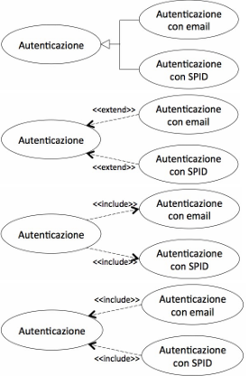
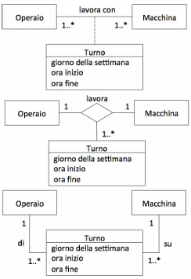
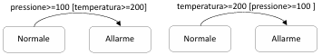
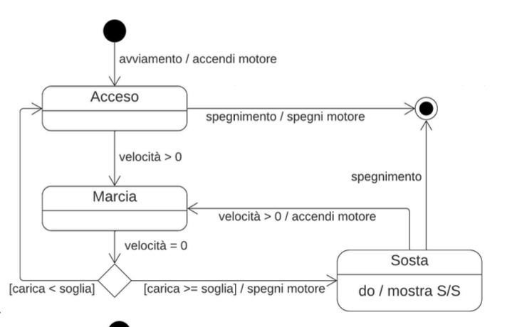
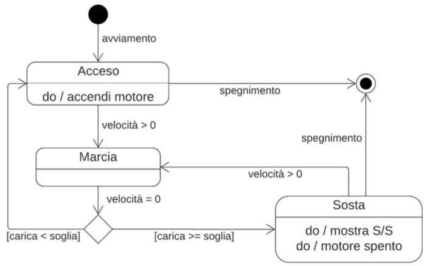
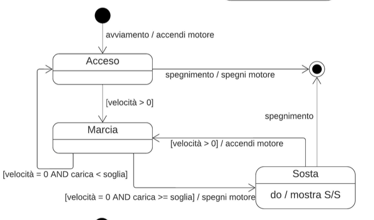
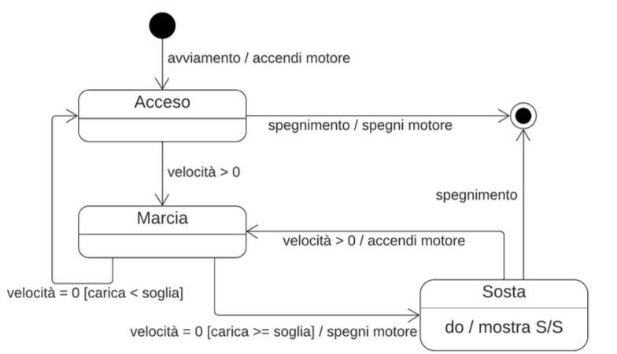

# 2021-01
**1) Com’è classificata la riusabilità di un software?** \
a. Esterna e di Processo \
b. Interna e di Prodotto \
c. Esterna e di Prodotto \
d. Interna e di Processo 

**2) Quali di questi diagrammi UML vengono normalmente utilizzati a supporto del collaudo del software, con particolare 
riferimento al “testing in the large”?** \
a. Sequenza \
b. Attività \
c. Classi \
d. Casi d'uso 

**3) Quali di queste tecniche di verifica sono applicabili in un contesto black-box?** \
a. Code walk-through \
b. Testing in the small \
c. Code inspection \
d. Testing in the large \
e. nessuna delle precedenti 

**4) Un software viene modificato per aumentare l'efficienza di una funzionalità di importazione massiva di dati. Di che 
tipo di manutenzione si tratta?** \
a. Correttiva \
b. Evolutiva \
c. Perfettiva \
d. Adattiva 

**5) Quali di questi modelli sono specificamente pensati per situazioni progettuali in cui i requisiti utente sono incerti o 
mutevoli nel tempo?** \
a. Modello MDA \
b. Modello RAD \
c. Modello a cascata \
d. Nessuno dei precedenti 

**6) Quali delle seguenti affermazioni, riguardanti le funzioni di tipo dato e tipo transazione, sono vere?** \
a. La logica di un processo EQ (External Inquiry) non contiene formule matematiche o calcoli e non crea dati derivati \
b. Il compito primario di un EIF (External Interface File) è di contenere dati referenziati da uno o più processi elementari dell’applicazione che si sta contando \
c. Il compito principale di un EO (External Output) è di modificare il comportamento del sistema  \
d. Nessuna delle precedenti 

**7) Le special GUI sono pensate per situazioni in cui...** \
a. ...l'utente deve effettuare un data-entry massivo \
b. ...l'utente può avere scarsa esperienza con l'utilizzo dei PC \
c. ...la soddisfazione dell'utente nell'uso dell'interfaccia è importante \
d. ...memorabilità e apprendibilità dell'interfaccia non sono importanti

**8) L'autenticazione a un portale si può effettuare tramite email oppure tramite lo SPID (Sistema Pubblico d'Identità 
Digitale). Scegliere tra le seguenti soluzioni di modellazione quella più corretta.** \


# 2021-02
**1) Un operaio effettua turni settimanali di lavoro alle macchine. Durante ogni turno ciascun operaio lavora a una singola 
macchina, e ogni macchina è manovrata da un singolo operaio. Scegliere, tra le seguenti soluzioni di modellazione, quella 
ritenuta più appropriata.** \


**2) Cosa si intende per “messa in produzione” del software?** \
a. il momento in cui inizia la fase di analisi dei requisiti \
b. il momento in cui inizia la fase di esercizio del software \
c. il momento in cui inizia la fase di implementazione \
d. il momento in cui inizia la fase di diagnosi e manutenzione \
e. il momento in cui inizia la fase di progettazione del software \
f. il momento in cui inizia la fase di collaudo \
g. il momento in cui il software viene installato 

**3) Quali tra i seguenti sono meccanismi di estendibilità in UML?** \
a. specifiche \
b. viste \
c. profili \
d. diagrammi \
e. proprietà \
f. stereotipi 

**4) E' dato il seguente frammento di pseudocodice:**
``` 
begin 
    read (A,B,C)
    if (A>0) AND (B<0) then 
        C := C/(A+B) 
end 
```
Quali dei seguenti insiemi di test soddisfano il criterio di copertura delle decisioni? \
a. {(A=2, B= –1, C=3), (A= –1, B=2, C=0)} \
b. {(A=2, B=1, C=0), (A=-1, B= –1, C=3)} \
c. {(A=2, B= –1, C=3)} \
d. {(A=2, B= –1, C=3), (A= –1, B= –1, C=3)} 

**5) Cosa si intende per affordance in ambito interfacce utente?** \
a. il posizionamento strutturato di testo, disegni e controlli all’interno di un’area grafica considerata \
b. gli aspetti grafici di un oggetto che invitano l'utente a interagire con quell'oggetto in un certo modo \
c. una figura che illustra un oggetto attraverso una somiglianza o un’analogia con un concetto del mondo reale 

**6) Quali tra le seguenti tecniche possono essere ricondotte al principio di separazione degli argomenti?** \
a. la capacità di prevedere i cambiamenti a cui il software sarà sottoposto durante il suo ciclo di vita \
b. la ricerca di un problema noto che generalizzi il problema da risolvere \
c. l'utilizzo di formalismi e metodologie standard \
d. l'identificazione, nel ciclo di vita, di attività distinte e temporalmente correlate  \
e. l'identificazione di moduli distinti e interconnessi all'interno del software 

# 2021-06
**1) Dato il seguente frammento di pseudocodice, se ne calcoli la complessità ciclomatica:**
```
begin 
  read(N); 
  read(x); 
  for i:=1 to N do 
    read(V[i]); 
  i:=1; 
  K:=0; 
  while (i<N) AND (K<100) do 
  begin 
    if (x<>0) 
      V[i]:=(V[i]+V[i+1])/x; 
    K:=K+V[i]; 
    i:=i+1; 
  end 
end 
```
**2) Dati i due seguenti frammenti di diagrammi degli stati, dire se modellano lo stesso comportamento al variare di 
temperatura e pressione.**
 

a. SI \
b. NO \
c. solo quando o temperatura o pressione si mantengono costanti 

**3) In un diagramma di deployment, quali tra i seguenti possono essere modellati come manufatti?** \
a. un file sorgente Java \
b. un file eseguibile \
c. un PC usato come server \
d. l’ambiente Apache 

**4) Quali sono i risultati attesi da uno studio di fattibilità?** \ 
a. stima dei costi del software \
b. stima dei tempi di realizzazione del software \
c. valutazione dei benefici del software \
d. macroanalisi dei requisiti \
e. progetto di massima del software \
f. casi d’uso del software 

**5) A quali di questi criteri è consigliato attenersi nella scelta dei colori per un’interfaccia grafica?** \
a. basarsi su un codice di due soli colori \
b. basarsi su un codice di non più di cinque colori \
c. usare colori vivaci per aree grandi e neutri per aree piccole \
d. non usare colori contrastanti tra loro per evitare affaticamento della vista \ 
e. se lo sfondo è chiaro, usare un colore scuro per il testo \
f. usare colori brillanti per applicazioni gestionali 

**6) Cosa afferma il principio di anticipazione dei cambiamenti?** \
a. un software deve soddisfare esclusivamente le specifiche funzionali attuali \
b. un software deve soddisfare sia le specifiche funzionali attuali sia quelle prevedibili per il breve/medio termine \
c. un software deve soddisfare le specifiche funzionali attuali ma essere predisposto per poter soddisfare, con bassi costi \
di manutenzione, anche quelle prevedibili per il breve/medio termine 

# 2024-01

1. Il meccanismo di Start-Stop nelle automobili ha l’obiettivo di ridurre gli sprechi di carburante. Nel momento in cui il
veicolo si ferma (per esempio a un semaforo), il motore viene automaticamente spento, per essere automaticamente
riavviato quando il veicolo si rimette in movimento (quando lo Start-Stop si attiva, viene mostrata una spia sul cruscotto).
Se la carica della batteria scende sotto una soglia di sicurezza, il meccanismo non viene attivato. Selezionare, tra i seguenti
diagrammi degli stati, quelli corretti e compatibili con le specifiche (6/31 punti).





